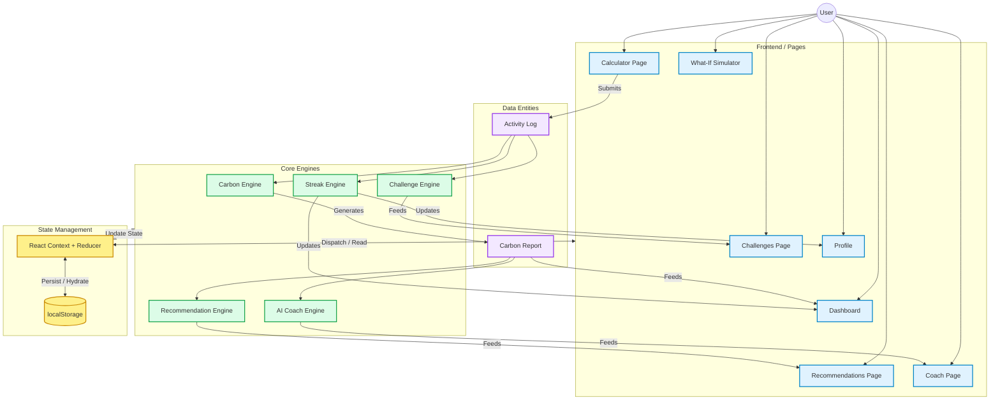

# EcoMentor AI

A personalized, AI-driven carbon footprint tracking and reduction platform built for the modern eco-conscious individual.

---

## 1. Challenge Overview
**Challenge:** Carbon Footprint Awareness Platform
**Goal:** Empower individuals to track, understand, and reduce their environmental impact through personalized insights, gamification, and actionable recommendations.

## 2. Problem Statement
Despite growing environmental awareness, many individuals struggle to understand their personal carbon footprint and lack actionable, personalized guidance on how to reduce it. Existing tools often provide generic advice and fail to engage users over the long term, leading to abandoned sustainability efforts.

## 3. Solution Overview
EcoMentor AI is a comprehensive web application designed to bridge the gap between awareness and action. It calculates a user's carbon footprint based on daily activities, offers an interactive "What-If" simulator to visualize the impact of lifestyle changes, and provides rule-based AI coaching tailored to individual behaviors. With built-in gamification elements like streaks and weekly challenges, EcoMentor AI ensures sustained engagement and continuous improvement in eco-friendly habits.

## 4. Features

- **Carbon Footprint Calculator:** Accurately estimate daily and weekly carbon emissions based on transportation, energy usage, and dietary choices.
- **Personalized Recommendations:** Receive tailored suggestions to reduce your footprint based on your highest emission categories.
- **AI Coach:** A smart, rule-based AI assistant that analyzes your data to provide timely advice, encouragement, and actionable insights.
- **Weekly Challenges:** Participate in dynamic weekly challenges designed to promote sustainable habits and foster community engagement.
- **Streak Tracking:** Build and maintain momentum with a streak engine that rewards consistent eco-friendly actions and logs.
- **Dashboard Analytics:** Visualize your environmental impact over time with intuitive, interactive charts and emission breakdowns.
- **What-If Simulator:** Experiment with potential lifestyle changes (e.g., "What if I switch to a vegan diet?") and instantly see the projected reduction in your carbon footprint.
- **User Profile Management:** Customize your experience, track your progress, and manage your sustainability goals in a centralized hub.

## 5. System Architecture

### 5.1 Architecture Diagram



### 5.2 Component Explanations

**UI / Pages Layer:**
*   **Calculator Page:** The entry point for users to log their daily activities (transportation, energy, food).
*   **Dashboard:** The central hub displaying visualizations of the user's carbon footprint, historical trends, and current streaks.
*   **Recommendations, Coach, & Challenges Pages:** Dedicated views for users to interact with personalized tips, receive AI coaching feedback, and track active weekly challenges.
*   **What-If Simulator:** An interactive sandbox where users can adjust variables to predict how lifestyle changes will impact their future emissions.
*   **Profile:** Manages user settings, baseline configurations, and earned badges/achievements.

**Core Engines (Logic Layer):**
*   **Carbon Engine:** The mathematical core that converts raw user activity logs into standardized carbon emission metrics (CO2e).
*   **Recommendation Engine:** Analyzes the output from the Carbon Engine to identify high-emission areas and generate actionable reduction strategies.
*   **AI Coach Engine:** A rule-based system that monitors user progress over time, offering timely encouragement, behavioral nudges, and insights.
*   **Challenge Engine:** Manages the lifecycle of weekly challenges (e.g., "Meatless Monday"), verifying completion based on user logs.
*   **Streak Engine:** Tracks consecutive days of logging or goal-meeting, gamifying the experience to encourage consistent engagement.

**State & Persistence Layer:**
*   **React Context + Reducer:** Acts as the single source of truth for the application's global state, handling complex state transitions cleanly without prop-drilling.
*   **localStorage:** The lightweight persistence layer ensuring user data is saved across sessions natively in the browser, providing a fast, offline-capable experience.

### 5.3 Data Flow Description

1.  **Input:** The `User` interacts with the `Calculator Page` to input daily behaviors, which creates an `Activity Log`.
2.  **Processing:** The `Activity Log` is dispatched to the global state (`React Context`) and immediately processed by the `Carbon Engine`.
3.  **Analysis:** The `Carbon Engine` calculates the emissions and generates a comprehensive `Carbon Report`.
4.  **Distribution:** This `Carbon Report` is broadcast to downstream engines:
    *   The `Recommendation Engine` uses it to suggest improvements.
    *   The `AI Coach Engine` uses it to formulate personalized advice.
5.  **Gamification:** Simultaneously, the raw `Activity Log` triggers the `Challenge Engine` (to check for challenge completions) and the `Streak Engine` (to increment consecutive days).
6.  **Presentation:** The updated state flows back down to the UI components (`Dashboard`, `Coach Page`, etc.), instantly reflecting the new data and achievements.
7.  **Persistence:** Every state change triggered by the Reducer is automatically serialized and saved to `localStorage`, ensuring no data loss if the user refreshes or closes the tab.

### 5.4 Why This Architecture is Scalable and Maintainable

*   **Separation of Concerns:** By strictly decoupling the UI layers from the business logic (Engines) and data management (Context/Reducer), the application is easier to test, debug, and expand. You can modify the calculation logic without touching the UI components.
*   **Predictable State Management:** Using a centralized Context + Reducer pattern ensures that state transitions are explicit and predictable. It avoids the chaos of scattered `useState` hooks when managing complex, interdependent data (like streaks depending on logs).
*   **Modular "Engine" Pattern:** Adding new features (e.g., a "Team Leaderboard Engine") is straightforward. New engines can simply plug into the existing data flow, consuming the `Activity Log` or `Carbon Report` without breaking existing systems.
*   **Performant and Offline-Ready:** Relying on `localStorage` and client-side processing removes database latency, making the app feel incredibly snappy. This sets a solid foundation before eventually migrating to a cloud database (like Supabase or Firebase), which would only require swapping out the persistence layer, not the core application logic.

## 6. Application Workflow
1. **Onboarding:** Users complete a quick profile setup to establish baseline carbon emissions.
2. **Daily Logging:** Users input daily activities (transportation, energy, food) to calculate their current footprint.
3. **Analysis:** The engine processes the data and updates dashboard analytics in real-time.
4. **Coaching & Recommendations:** The AI Coach generates personalized feedback and suggests weekly challenges based on recent logs.
5. **Simulation:** Users can explore the "What-If" simulator to plan future lifestyle changes.
6. **Progress Tracking:** Streaks and badges are awarded for consistent tracking and challenge completion.

## 7. Technologies Used
- **Core:** Next.js 15, React 19, TypeScript
- **Styling:** Tailwind CSS, Lucide React (Icons)
- **Visualization:** Recharts
- **Tooling:** ESLint, Prettier, npm

## 8. Folder Structure
```text
EcoMentorAi/
├── public/               # Static assets
├── src/
│   ├── app/              # Next.js App Router pages and layouts
│   ├── components/       # Reusable UI components
│   ├── charts/           # Recharts visualization components
│   ├── engines/          # Core logic (AI Coach, Recommendations, Streaks)
│   ├── lib/              # Utility functions and helpers
│   ├── store/            # State management and LocalStorage wrappers
│   └── types/            # TypeScript interfaces and types
├── tailwind.config.ts    # Tailwind CSS configuration
├── tsconfig.json         # TypeScript configuration
└── package.json          # Project dependencies and scripts
```

## 9. Installation Instructions

1. Clone the repository:
   ```bash
   git clone <repository-url>
   cd EcoMentorAi
   ```

2. Install dependencies:
   ```bash
   npm install
   ```

## 10. Running Locally

1. Start the development server:
   ```bash
   npm run dev
   ```

2. Open your browser and navigate to:
   ```text
   http://localhost:3000
   ```

## 11. Assumptions
- The application relies on `localStorage` for data persistence to prioritize privacy and offline usage during this development phase.
- AI Coaching is currently driven by a sophisticated rule-based engine, requiring no external API keys or continuous network connectivity.
- Carbon emission calculations are based on standardized global averages and may vary slightly by specific geographical regions.

## 12. Known Limitations
- Data is tied to the user's browser; clearing browser data will reset progress.
- Cross-device synchronization is not currently supported without a backend database.
- The rule-based AI Coach, while robust, does not utilize Large Language Models (LLMs) for conversational interactions in the current iteration.

## 13. Future Improvements
- **Backend Integration:** Migrate data storage from `localStorage` to a robust cloud database (e.g., Firebase or Supabase) for cross-device syncing.
- **LLM Integration:** Enhance the AI Coach with OpenAI or Gemini APIs for conversational, context-aware interactions.
- **Social Features:** Implement leaderboards, team challenges, and social sharing capabilities.
- **PWA Support:** Convert the application into a Progressive Web App for native-like mobile experiences.

## 14. Screenshots Section
*(Placeholders for future UI screenshots)*

- **Dashboard:** .png)
- **What-If Simulator:** .png)
- **AI Coach Interface:** .png)
- **Weekly Challenges:** 

## 15. Why EcoMentor AI Stands Out

Unlike traditional carbon calculators that only report emissions, EcoMentor AI closes the action loop through:

- Personalized Recommendation Engine
- Rule-Based AI Coach
- Weekly Sustainability Challenges
- Streak & Badge Gamification
- What-If Simulation Engine

This transforms carbon awareness into sustained behavioral change.

## 16. Smart Assistant Logic

EcoMentor AI includes a dynamic coaching assistant that:

- Analyzes emission patterns
- Identifies dominant emission categories
- Generates personalized advice
- Reinforces positive habits
- Suggests improvement opportunities
- Tracks user progress over time

The assistant adapts recommendations based on user behavior rather than displaying static tips.

- Dashboard visualization rendering may vary depending on browser and Recharts compatibility.
- Fallback visualization cards are displayed when chart rendering is unavailable.

## 17. Demo Video

https://link...

## 18. Conclusion
EcoMentor AI demonstrates a powerful, user-centric approach to environmental sustainability. By combining accurate tracking, intelligent coaching, and engaging gamification within a modern tech stack, it provides a scalable foundation for empowering individuals to make meaningful reductions to their carbon footprint.
